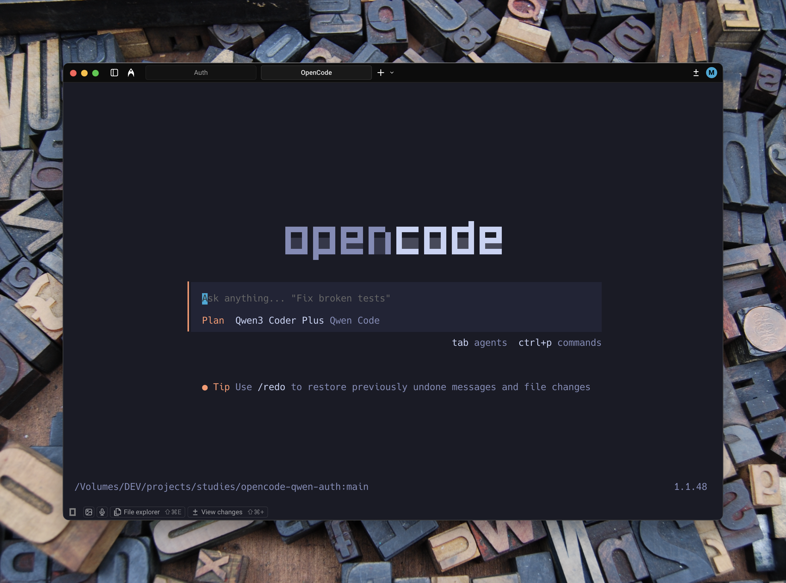

# 🤖 OpenCode 的 Qwen OAuth 插件


<p align="center">
  
</p>

**使用你的 qwen.ai 账号为 OpenCode CLI 登录。** 该插件可让你使用 Qwen OAuth 模型（`coder-model` 与 `vision-model`），享受 **每天 2,000 次免费请求**，无需 API Key 或信用卡。

[🇺🇸 English](./README.md)

## ✨ 功能

- 🔐 **OAuth Device Flow**：基于浏览器的安全登录（RFC 8628）
- ⚡ **自动轮询**：授权完成后自动检测，无需手动回车
- 🆓 **免费额度**：每天 2,000 次请求
- 🧠 **超长上下文**：支持最高 1M 上下文模型
- 🔄 **自动续期**：Token 过期前自动刷新
- 🔗 **兼容 qwen-code**：复用 `~/.qwen/oauth_creds.json` 凭据

## 📋 前置条件

- 已安装 [OpenCode CLI](https://opencode.ai)
- 一个 [qwen.ai](https://chat.qwen.ai) 账号（可免费注册）

## 🚀 安装

### 1) 安装插件

```bash
cd ~/.opencode && npm install opencode-qwencode-auth
```

### 2) 启用插件

编辑 `~/.opencode/opencode.jsonc`：

```json
{
  "plugin": ["opencode-qwencode-auth"]
}
```

## 🔑 使用

### 1) 登录

```bash
opencode auth login
```

### 2) 选择 Provider

选择 **"Other"**，输入 `qwen-code`

### 3) 完成授权

选择 **"Qwen Code (qwen.ai OAuth)"**

- 浏览器会自动打开授权页
- 授权完成后插件会自动检测并保存

> [!TIP]
> 在 OpenCode TUI 中，**Qwen Code** provider 会自动出现在 provider 列表。

## 🎯 可用模型

| 模型 | ID | 输入 | 输出 | 上下文 | 最大输出 | 费用 |
|------|----|------|------|--------|----------|------|
| Qwen Coder (Qwen 3.5 Plus) | `coder-model` | text | text | 1M tokens | 65,536 tokens | Free |
| Qwen VL Plus (Vision) | `vision-model` | text, image | text | 128K tokens | 8,192 tokens | Free |

### 指定模型运行

```bash
opencode --provider qwen-code --model coder-model
opencode --provider qwen-code --model vision-model
```

## ⚙️ 工作原理

```
┌─────────────────┐     ┌──────────────────┐     ┌─────────────────┐
│   OpenCode CLI  │────▶│  qwen.ai OAuth   │────▶│  Qwen Models    │
│                 │◀────│  (Device Flow)   │◀────│  API            │
└─────────────────┘     └──────────────────┘     └─────────────────┘
```

1. Device Flow 打开 `chat.qwen.ai` 授权页面
2. 插件自动轮询授权结果
3. 凭据保存到 `~/.qwen/oauth_creds.json`
4. Access Token 在到期前自动刷新

## 📊 使用限制

| 计划 | 频率限制 | 每日限制 |
|------|----------|----------|
| 免费（OAuth） | 60 req/min | 2,000 req/day |

> [!NOTE]
> 配额通常按 UTC 零点重置。若需更高额度，可考虑使用 [DashScope](https://dashscope.aliyun.com) API Key。

## 🔧 故障排查

### Token 过期或异常

```bash
# 删除旧凭据
rm ~/.qwen/oauth_creds.json

# 重新登录
opencode auth login
```

### `auth login` 中看不到 provider

`qwen-code` 是插件注入的 provider。请在 `opencode auth login` 中：

1. 选择 **"Other"**
2. 输入 `qwen-code`

### 遇到 429 限流

- 等待 UTC 零点重置
- 配额耗尽时切换账号并重新登录
- 需要更高额度可使用 DashScope API

## 🛠️ 开发

```bash
# 克隆仓库
git clone https://github.com/1579364808/opencode-qwen-auth.git
cd opencode-qwencode-auth

# 安装依赖
bun install

# 类型检查
bun run typecheck
```

### 本地联调

编辑 `~/.opencode/package.json`：

```json
{
  "dependencies": {
    "opencode-qwencode-auth": "file:///absolute/path/to/opencode-qwencode-auth"
  }
}
```

然后重新安装：

```bash
cd ~/.opencode && npm install
```

## 📄 License

MIT
